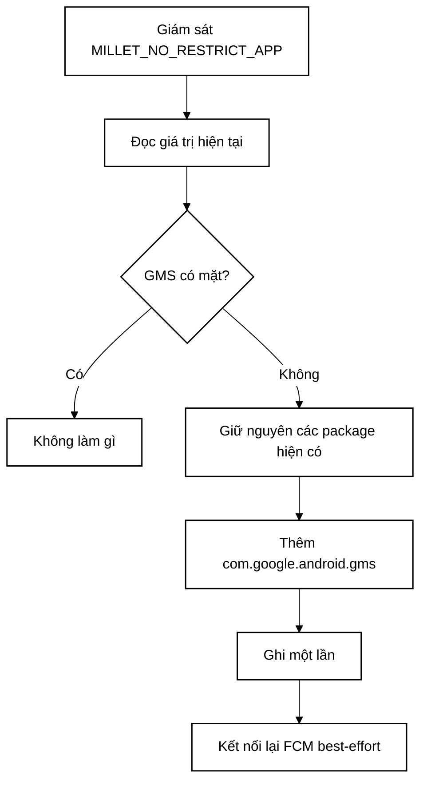

<p align="center">
  <a href="README.md"><strong>Tiếng Việt</strong></a> · <a href="README.en.md">English</a> · <a href="README.zh-CN.md">简体中文</a>
</p>

<p align="center">
  
</p>

# FCM Guard for HyperOS

**Công cụ canh giữ nhẹ, không cần root dành cho HyperOS 3 bản ROM Trung Quốc, giữ Google Play services luôn nằm trong danh sách nền "không giới hạn" của Xiaomi để thông báo đẩy FCM luôn ổn định.**

**Thiết kế cho:** điện thoại Xiaomi / Redmi / POCO bản Trung Quốc, đã cài Google Play services và đang hoạt động bình thường.

<p align="center">
  <a href="https://github.com/longhangoc/FCMGuard-HyperOS/releases/latest/download/FCMGuard-HyperOS.apk"><strong>Tải APK mới nhất</strong></a>
  ·
  <a href="https://github.com/longhangoc/FCMGuard-HyperOS/releases/latest">Bản phát hành mới nhất</a>
</p>

## Điểm nổi bật

- **Không cần root hay Shizuku** — chỉ dùng quyền **Sửa đổi cài đặt hệ thống** mà người dùng có thể tự cấp, thay vì root, ADB thường trực, Accessibility, VPN, overlay hay quyền quản trị thiết bị.
- **Thân thiện với app tài chính** — giữ chủ ý mức đặc quyền thấp để tương thích tốt với các app nhạy cảm về bảo mật.
- **Ít tốn pin khi chạy nền** — giám sát theo sự kiện chính xác là đường chính; kiểm tra dự phòng 30 phút chạy ngay trong tiến trình và không chủ động đánh thức điện thoại đang ngủ.
- **Chỉ kết nối lại khi cần** — yêu cầu kết nối lại FCM/MCS chỉ được gửi sau khi thực sự sửa danh sách trắng hoặc khi người dùng chủ động yêu cầu.
- **Thông báo thường trực tùy chọn** — chế độ nền trước dùng kênh thông báo hiển thị nhưng im lặng để tăng độ bền của tiến trình; vẫn có thể dùng chế độ chỉ chạy nền, im lặng.
- **Trợ lý app FCM** — quét các app có khả năng là client Firebase/GCM và, khi HyperOS cho phép đọc trạng thái AppOps của nhà sản xuất, hiển thị trạng thái Tự khởi động ở chế độ chỉ đọc, tự kiểm tra lại sau khi bạn quay về từ cài đặt hệ thống.
- **Chế độ tối gốc Android** — Theo hệ thống / Sáng / Tối, mặc định **Theo hệ thống**.
- **Giao diện 11 ngôn ngữ** — tiếng Anh, tiếng Trung giản thể, tiếng Trung phồn thể, tiếng Pháp, tiếng Nhật, tiếng Hàn, tiếng Tây Ban Nha, tiếng Bồ Đào Nha, tiếng Đức, tiếng Nga và tiếng Việt, qua cơ chế ngôn ngữ theo ứng dụng gốc của Android.
- **Sẵn sàng cho máy màn nhỏ** — kiểm tra bố cục tương thích cho độ rộng 320–480dp, gồm cả profile 393dp kiểu Xiaomi 17.

## Thiết lập nhanh

1. Cài APK mới nhất từ **GitHub Releases**.
2. Mở FCM Guard và cấp quyền **Sửa đổi cài đặt hệ thống**.
3. Chạm **Sửa ngay** một lần.
4. Bật **Bảo vệ tự động**.
5. Trong HyperOS, bật **Tự khởi động** cho FCM Guard và đặt chính sách pin thành **Không giới hạn**.
6. Giữ **Thông báo thường trực** bật để đạt độ bền tối đa. Nếu Android/HyperOS chặn thông báo của FCM Guard, app sẽ mở thẳng cài đặt thông báo hệ thống để bạn bật thông báo nền trước.
7. Tùy chọn: quét **Ứng dụng FCM**. Nếu HyperOS cho phép đọc trạng thái Tự khởi động, danh sách sẽ đánh dấu app là Đã bật / Một phần / Đã tắt / Không rõ và tự cập nhật sau khi bạn quay về từ **Cấu hình tất cả trong HyperOS**. Nếu ROM chặn truy vấn, FCM Guard hiển thị trạng thái Không rõ/không khả dụng thay vì đoán bừa.
8. Tùy chọn: chạm **Mở chẩn đoán FCM** để vào màn hình chẩn đoán của Google Play services và xem kết nối `mtalk.google.com:5228`.
9. Nếu chỉ một app vẫn nhận thông báo chậm trong khi các app FCM khác bình thường, hãy cấu hình riêng app đó. Với các app như **WhatsApp**, đặt **Trình tiết kiệm pin / Tối ưu hóa pin → Không giới hạn** trong HyperOS; cũng nên bật **Tự khởi động** cho app đó khi có tùy chọn.

> FCM Guard chủ yếu dành cho máy HyperOS 3 bản ROM Trung Quốc, nơi Google services hoạt động bình thường nhưng PowerKeeper / Greezer vẫn có thể ngắt kết nối FCM chạy nền.

---

# Tổng quan kỹ thuật

## Cơ chế chính

Các bản HyperOS bị ảnh hưởng có thể dựng lại giá trị cài đặt riêng tư sau:

```text
Settings.System.MILLET_NO_RESTRICT_APP
```

Nếu `com.google.android.gms` bị loại khỏi đó, Google Play services có thể bị coi như một tiến trình nền thông thường và kết nối FCM/MCS dài hạn của nó có thể bị ngắt.

FCM Guard đọc giá trị hiện tại (phân tách bằng dấu phẩy), giữ nguyên mọi package có sẵn, và chỉ thêm `com.google.android.gms` khi còn thiếu.



## Vì sao dùng `targetSdk 22`?

FCM Guard cố ý dùng `compileSdk 35` với `targetSdk 22`. Compile SDK hiện đại giúp dự án dùng công cụ build mới nhất, còn target cũ giữ lại đường dẫn tương thích cần thiết để ghi key riêng tư `Settings.System` của Xiaomi bằng quyền **Sửa đổi cài đặt hệ thống** người dùng tự cấp, không cần root/Shizuku.

## Thiết kế tiết kiệm pin

- `ContentObserver` chính xác chỉ cho `MILLET_NO_RESTRICT_APP`.
- Debounce ~400 ms sau mỗi thay đổi được ghi nhận.
- Dự phòng trong tiến trình mỗi 30 phút thay vì poll liên tục.
- Không dùng `AlarmManager`, báo thức chính xác lặp lại, hay WakeLock cho phần dự phòng.
- Không ghi khi GMS đã có sẵn.
- Không gửi broadcast kết nối lại trừ khi thực sự có sửa chữa hoặc người dùng yêu cầu.

## Thông báo thường trực

Chế độ thường trực chạy `GuardService` như một dịch vụ trên nền trước. Bản hiện tại dùng kênh thông báo riêng `IMPORTANCE_LOW`, im lặng, nên thông báo luôn hiển thị nhưng không có âm thanh hay rung. Vì FCM Guard chủ đích nhắm SDK 22, Android 13+ kiểm soát thời điểm hỏi quyền thông báo; nếu thông báo đã bị chặn, FCM Guard dẫn thẳng tới trang cài đặt thông báo hệ thống của app.

## Chẩn đoán FCM

**Mở chẩn đoán FCM** hiện ưu tiên chạy Activity hiện tại của Google Play services:

```text
com.google.android.gms/com.google.android.gms.gcm.GcmDiagnostics
```

`GTalkServiceDiagnostics` cũ vẫn được giữ làm phương án dự phòng tương thích, kèm bước tra cứu cuối cùng các Activity chẩn đoán trong Google Play services.

## Trợ lý app FCM

Bộ quét tìm các dấu hiệu manifest chuẩn như:

```text
com.google.firebase.MESSAGING_EVENT
com.google.android.c2dm.intent.RECEIVE
```

Khớp nghĩa là app nhiều khả năng là client FCM/GCM, nhưng không chứng minh mọi thông báo của app đó đều dùng FCM.

Với app được phát hiện, FCM Guard thực hiện kiểm tra **chỉ đọc, best-effort** các AppOps Tự khởi động của nhà sản xuất Xiaomi (`10008` và `10053`). Khi đọc được cả hai, giao diện hiển thị:

- **Đã bật** — cả hai AppOps Tự khởi động đều được phép.
- **Một phần** — một cái được phép, cái kia bị ignore rõ ràng.
- **Đã tắt** — cả hai đều bị ignore rõ ràng.
- **Không rõ** — HyperOS chặn truy vấn, trả về trạng thái nhà sản xuất/mặc định không thể diễn giải an toàn, hoặc không cung cấp kết quả đáng tin cậy.

FCM Guard không bao giờ coi **Không rõ** là **Đã tắt**. Nếu mọi app được phát hiện đều Không rõ, danh sách từng app sẽ bị ẩn và trợ lý chỉ giữ số lượng app phát hiện cùng hành động **Cấu hình tất cả trong HyperOS**. Sau khi quay về từ cài đặt HyperOS, kết quả mở rộng được kiểm tra lại tự động.

Không có trạng thái Tự khởi động nào bị sửa bằng lệnh, và không có đặc quyền Shizuku/root/ADB nào được đưa vào.

## Lưu ý gửi thông báo theo từng app

FCM Guard bảo vệ lớp truyền tải Google Play services / FCM, nhưng **không** ghi đè quy tắc pin của HyperOS cho từng app nhận. Một số app — gồm cả app nhắn tin như **WhatsApp** — có thể dùng FCM làm tín hiệu đánh thức và vẫn cần tiến trình riêng của nó chạy, mở kết nối nền, đồng bộ dữ liệu và tạo thông báo cục bộ.

Vì vậy, nếu chẩn đoán FCM ổn và các app khác nhận đẩy bình thường nhưng một app vẫn chậm, hãy cấu hình riêng app đó. Với WhatsApp, cài đặt HyperOS được khuyến nghị là:

**WhatsApp → Trình tiết kiệm pin / Tối ưu hóa pin → Không giới hạn**

Cũng bật **Tự khởi động** cho app bị ảnh hưởng khi ROM có tùy chọn này. Chỉ áp dụng cho các app thực sự bị chậm, thay vì tắt tối ưu hóa pin cho mọi app.

## Giao diện, ngôn ngữ và bố cục responsive

- Ba chế độ hiển thị: Theo hệ thống / Sáng / Tối.
- 11 ngôn ngữ gốc: tiếng Anh, tiếng Trung giản thể, tiếng Trung phồn thể, tiếng Pháp, tiếng Nhật, tiếng Hàn, tiếng Tây Ban Nha, tiếng Bồ Đào Nha, tiếng Đức, tiếng Nga và tiếng Việt.
- Profile tài nguyên riêng cho máy hẹp và máy rộng.
- Kiểm tra hình học trong CI cho độ rộng 320, 360, 393, 411, 430 và 480dp.

## Quyền hạn và quyền riêng tư

FCM Guard dùng `WRITE_SETTINGS`, `RECEIVE_BOOT_COMPLETED`, hỗ trợ dịch vụ nền trước/thông báo, và phạm vi nhìn thấy package hẹp cho các handler FCM/GCM, Google Play services, và Trung tâm Bảo mật Xiaomi.

Nó **không** yêu cầu root, Shizuku, ADB thường trực, Accessibility, VPN, overlay, quản trị thiết bị, truy cập tài khoản hay giám sát lưu lượng mạng.

## Giới hạn

Dự án này phụ thuộc vào cách HyperOS hiện tại của Xiaomi hoạt động. Xiaomi có thể thay đổi hành vi PowerKeeper / Greezer, cài đặt riêng tư, trang quản lý app, hay AppOps của nhà sản xuất trong các bản phát hành sau. Kết nối lại FCM, nhận diện client FCM và đọc trạng thái Tự khởi động đều là best-effort vì Android không có API công khai nào đảm bảo các thao tác riêng tư theo nhà sản xuất này.

FCM Guard bảo vệ kết nối GMS/FCM dùng chung; nó không thể đảm bảo HyperOS sẽ cho phép từng app có đủ thời gian chạy nền và mạng để xử lý tín hiệu FCM đã nhận. Cài đặt pin theo từng app vẫn có thể cần cho app như WhatsApp.

## Tham khảo & Ghi nhận

Cuộc điều tra PowerKeeper / Greezer và chiến lược sửa `MILLET_NO_RESTRICT_APP` ban đầu được ghi nhận bởi **HyperOS FCM Fix**:

- HyperOS FCM Fix của `dingwen07`: https://github.com/dingwen07/hyperos-fcm-fix
- Tài liệu điều tra kỹ thuật: https://github.com/dingwen07/hyperos-fcm-fix/blob/main/docs/xiaomi-hyperos-gms-fcm-greezer-investigation.md

FCM Guard là bản triển khai độc lập tập trung vào việc không cần Shizuku/root, đặc quyền tối thiểu, giám sát theo sự kiện và hoạt động nền nhàn rỗi thấp. Không có mã nguồn nào của HyperOS FCM Fix được sao chép vào repo này.

## Build

GitHub Actions kiểm tra profile bố cục responsive và build APK debug có ký. Push lên `main` sẽ phát hành/cập nhật GitHub Release theo phiên bản; nhánh feature có thể được kiểm tra trước khi phát hành.

Để cài lên điện thoại, dùng:

**https://github.com/longhangoc/FCMGuard-HyperOS/releases/latest/download/FCMGuard-HyperOS.apk**

## Giấy phép

MIT License — xem [LICENSE](LICENSE).
